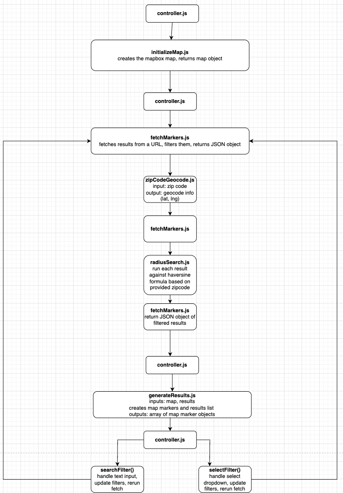

# P10MapKit

A refactored, more generalized version of the initial map kit repo.

This was initially set up specifically for a project which is intending to read all data from a generated JSON file. For that reason, there is a variable in controller.js, `let resultType = "ajax";` that will determine how the rest of the program functions. For alm/facetWP/custom ajax, this variable should be left as resultType = ajax. I will update this readme further as I complete this integration.

## enqueue

the wp_localize_script is specific to our niche case of using a JSON file as the source of data. This is required to pass the uploads directory url to javascript. If you are doing a more traditional ALM/facetWP/custom Ajax approach, you can skip that step and just enqueue the script module.

```
wp_enqueue_script_module('@p10/map-kit-refactor', get_template_directory_uri() . '/p10MapKit/controller.js', array(), filemtime(get_template_directory() . '/p10MapKit/controller.js'));

// Get the uploads directory information
// Get the uploads directory information
$uploads = wp_upload_dir();

// Output the uploads data as a global variable
echo '<script type="text/javascript">';
echo 'const wpUploads = ' . json_encode(array(
    'baseurl' => $uploads['baseurl'], // URL to the uploads folder
    'basedir' => $uploads['basedir'], // Path to the uploads folder
)) . ';';
echo '</script>';

// Pass the uploads URL to the JavaScript file
wp_localize_script('@p10/map-kit-refactor', 'wpUploads', array(
    'baseurl' => $uploads['baseurl'], // URL to the uploads folder
    'basedir' => $uploads['basedir'], // Path to the uploads folder
));
```

## controller.js

this is the entry point of this application. It expects access to a mapbox access token, and a mapbox map style url.

First it calls the initializeMap module.

```
let map = initializeMap(accessToken, mapStyles, mapArgs);
```

## initializeMap.js

initializeMap takes a mapbox access token, a map styles URL, and an [object](https://docs.mapbox.com/mapbox-gl-js/api/map/) of map parameters as arguments. Currently the access token and map styles are being set as a data attribute for simplicity while I was setting this up, but we should probably put them in a private file somewhere or something.

The sole purpose of this function is to initialize the mapbox map. it expects there to be a div with the ID "map" somewher on the page.

this module returns the map object back to controller.js

## fetchMarkers.js

this fetchMarkers takes a URL, as well as an object of search filters as arguments. Search filters are the values from the select dropdown and the text input, saved as an object.

The purpose of this function is to fetch results from a url, then filter the JSON object against whatever filters are set (search input, or dropdown). This then returns the filtered results as a JSON object.

The JSON object format can be found in testing.json. The rest of the code expects each object to have the properties included in these test objects.

This function utilizes the zipCodeGeocode.js function and the radiusSearch.js function, which are described below, under the 'helper functions' section.

In the case of an ajax integration, this function is skipped when the resultType variable is set to "ajax" as mentioned at the start of this readme.

## generateResults.js

This function takes the map instance, as well as an array of results returned from fetchMarkers as arguments.

The array is used to generate the actual HTML elements of list results, as well as the mapbox map markers.

This function also initializes the markerController.js function, which handles click events on results listings and markers.

## searchfilter() and selectFilter() functions

These two functions handle changes to the select dropdown and the search text input. On submit, they take these values and re-run fetchMarkers.js and generateResults.js with the updated filters. This should probably be moved into their own separate files for readability.

## Helper functions

#### zipCodeGeocode.js

This function accepts a zipcode, and a mapbox access token as arguments. It's sole function is to fetch geocode data for a zipcode from mapbox, and return the lat, lng coordinates.

#### radiusSearch.js

this function accepts a single JSON object with lat and lng properties, as well as the lat and lng coordinates returned from zipCodeGeocode.js. The sole purpose of this function is to run the haversine formula against these two coordinates, and determine if the provided result lands within or outside of the set radius. By default this function is hard-coded to search a radius of 50 miles.

#### markerController.js

This function handles click events for results in the results list, as well as the map markers. On click it will highlight the selected result in the result list, and zoom to the selected marker in the map.

#### radiusSearch.php

this is an untested PHP version of the radiusSearch function. This would be used in conjunction with a custom AJAX request, or with ALM or facetWP with a hook in order to filter custom post type results.

## UML Diagram

I haven't made one of these since college and completely forget the actual rules, but I tried to model this application to provide an easier way to understand the flow of data or whatever


